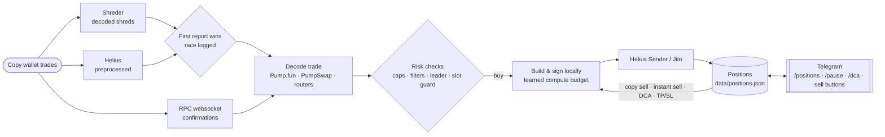

<div align="center">

# ⚡ Solana Copy-Trading Bot

**Mirrors chosen Solana wallets' trades on Pump.fun, PumpSwap and Raydium within milliseconds, controlled from Telegram.**


[Quick start](#-quick-start) · [How it works](#-how-it-works) · [Trade modes](#-trade-modes) · [Selling](#-selling-instant-sell-and-dca) · [Speed](#-built-for-speed) · [Rust fast path](#-rust-fast-path) · [Telegram](#-telegram-control) · [Reading the logs](#-reading-the-logs) · [Helius credits](#-helius-credits) · [Troubleshooting](#-troubleshooting) · [Full reference](docs/REFERENCE.md)

</div>

---

## ✨ Highlights

- **Sees trades before they land.** Shred streams (Helius preprocessed, Shreder, Jito gRPC) report the copy wallet's transaction as the slot leader produces it, hundreds of milliseconds before an RPC websocket would. Run two side by side and the bot uses whichever is first and logs which one won.
- **Builds its own transactions.** Pump.fun, PumpSwap and Raydium swaps are built and signed locally, with blockhash and config pre-fetched, so a buy needs at most one network round trip and often none. In live logs the fast path goes from seeing a trade to sending its own buy in **0.2–0.4 ms**.
- **Lands early in the block.** Sends through Helius Sender (Jito plus staked connections) or Jito, sizes compute units from what each kind of trade really used, and can cancel a buy on-chain if it would land too many slots after the copy wallet's.
- **Exits as fast as it enters.** Mirrors sells proportionally, or sells the instant its own buy lands (`INSTANT_SELL`), optionally in cheap parts over a few seconds (`DCA_SELLING`). Bookkeeping counts only confirmed transactions, and failed sells are retried, so no position is forgotten.
- **Hard risk limits.** Per-trade and total exposure caps, a limit on open positions, a buy cooldown, market-cap and transfer-tax filters, and a skip when the slot leader is too far away. Pause buying from Telegram at any time while exits keep working.
- **Tells you about the coin.** Each buy message carries market cap, curve progress, creator and top-10 holdings, the coin's website, X and Telegram links, and whether the website actually shows the coin's address.
- **Measures itself.** `[Timing]`, `[Race]`, `[Host]` and `[Usage]` log lines show where every millisecond and every RPC credit goes, plus scripts that check past buys by slot leader and benchmark your server.

---

## 🧭 How it works



1. **Detect.** One or more shred feeds watch the copy wallets. The websocket feed runs alongside to confirm results and catch anything the shreds can't read.
2. **Decide.** The trade is decoded (including learned router formats). It is then checked against your limits, filters, slot leader distance and the slot guard.
3. **Execute.** The bot builds and signs the swap locally and sends it with your priority fee and tip. It then follows the result to confirmation.
4. **Exit.** Mirrors the copy wallet's sells, sells immediately (whole or in parts), or exits on take-profit, stop-loss or trailing stop, depending on the mode.
5. **Report.** Telegram gets the buy and sell with PnL, timing and links. The log gets the detail.

**Which venues it buys on.** Pump.fun bonding-curve coins, PumpSwap (graduated Pump.fun coins) and Raydium (AMM v4 and CPMM) are built directly. A buy on any other venue is skipped and the log says why. Sells also have Jupiter and SolanaPortal as routes for coins the direct builders can't handle.

---

## 🚀 Quick start

**You need:** Node.js 20 or 22 (18.17 or newer works), a paid Solana RPC with websockets (e.g. Helius), and a **dedicated burner wallet** holding only what you're willing to trade. For the fastest setup, add a Helius plan with the shred feed, a Helius Sender API key, and a small server near the validators (for example a 2-core server in Frankfurt).

```bash
# 1. Get the code
git clone https://github.com/Maxim-Karpov/solana-copy-trading-bot.git
cd solana-copy-trading-bot
npm install

# 2. Configure
cp .env.example .env
chmod 600 .env
nano .env               # RPC, wallet, copy wallets, mode, limits

# 3. Check and run
npm run check-env       # missing or misspelt settings (never prints values)
npm test                # 190 tests, fully simulated, no network or funds
npm start
```

**Settings to fill in first**

| Setting | What to put |
|---|---|
| `SOLANA_RPC` | Your RPC address with its API key (`SOLANA_WS` is worked out from it unless your provider needs a different one) |
| `PRIVATE_KEY`, `PUBLIC_KEY` | The burner wallet (the two must match) |
| `COPY_WALLET` | One or more wallets to copy, comma-separated |
| `TRADE_TYPE` | `EXACT`, `SAFE`, `TIERED` or `STIERED` ([modes](#-trade-modes)) |
| `MAX_BUY_AMOUNT`, `MAX_TOTAL_EXPOSURE`, `MAX_OPEN_POSITIONS` | Your hard limits in SOL and positions |
| `SEND_VIA`, `SENDER_ENDPOINT` | `"sender"` plus the endpoint **with `?api-key=`** ([why](#sender-needs-your-api-key)) |
| `TELEGRAM_BOT_TOKEN`, `TELEGRAM_CHAT_ID` | Optional but strongly recommended |

By default the bot **starts paused** (`START_PAUSED="true"`): it sends a Telegram message with a **Resume** button and buys nothing until you tap it. Exits work while paused.

**On a server**, run it under [pm2](https://pm2.keymetrics.io/) so it survives logouts and restarts after a crash:

```bash
npm install -g pm2
pm2 start ecosystem.config.js
pm2 logs copybot
pm2 save && pm2 startup     # start again after a reboot
```

> [!TIP]
> **Try it without buying.** Start paused, and the bot does a full *rehearsal* of every copy buy (built and signed, never sent) with timings. With `REHEARSE_ONLY="true"` it can never buy at all.

### Helper scripts

| Command | What it does |
|---|---|
| `npm run check-env` | Lists missing or misspelt settings (never prints values) |
| `npm run check-site -- <page> <coin address>` | Does a coin's web page show its address? Runs the same safety filters and page check as a live buy |
| `npm run check-plain -- <coin address>` | Simulates a buy with the cheaper token account (`TOKEN_ACCOUNT_MODE="plain"`) against the usual one |
| `npm run vps-bench` | How fast is this server for the bot? CPU, signing speed, and the round trip to Sender and your RPC |
| `npm run leaders` | Which of your past buys made the copy wallet's block, grouped by slot leader location and ping |
| `npm run leaders -- --ping <validator>` | Locate and ping particular validators (identity or vote address, or IP) from this server |
| `npm run shreder-check` | Proves a Shreder endpoint is reachable from this server in 20 seconds |

---

## 🎯 Trade modes

| Mode | Buy size | Exit |
|---|---|---|
| `EXACT` | Same SOL as the copy wallet | Any sell by the copy wallet sells 100% |
| `SAFE` | Fixed `BUY_AMOUNT` | Your own take-profit, stop-loss or trailing stop |
| `TIERED` | Scales with the copy wallet's buy (`TIER_BUY_CONFIG`) | Take-profit, stop-loss or trailing stop |
| `STIERED` | Scales with the copy wallet's buy | Mirrors its sells **proportionally**: it sells 40%, you sell 40% |

On top of any mode:
- **`INSTANT_SELL`** sells the moment the buy lands (optionally after `INSTANT_SELL_DELAY_MS`), in one go or [in parts](#-selling-instant-sell-and-dca).
- **`SELL_AFTER_SECONDS`** sells a fixed time after the buy confirms.
- **`FULL_EXIT_ON_COPY_SELL`** treats any copy-wallet sell as a full exit.
- **`MIRROR_TRANSFERS`** (default on) counts the copy wallet moving tokens out (sent, burned or swapped into another token) as a sell of the same percentage.
- **`ONLY_COPY_FIRST_BUY`** ignores its later buys of a coin you already hold. **`SKIP_REBUYS`** (`off`, `full`, `any`) ignores its buys of a coin it has already exited.

`COPY_WALLET` takes several addresses separated by commas. Each position follows the sells of the wallet whose buy opened it, and another wallet's buy of a coin you hold is not copied.

**Filters a buy must pass:** `MIN_MARKET_CAP_SOL` / `MAX_MARKET_CAP_SOL` (the latter enforced on-chain too, so a fast shred buy can't overpay), `BLOCKED_CREATORS`, `MAX_TOKEN_TAX_PCT` (Token-2022 transfer fee), `MAX_SLOTS_BEHIND`, `LEADER_MAX_KM`, `BUY_COOLDOWN_SEC`, and the exposure and open-position caps.

---

## 💸 Selling: instant sell and DCA

With `INSTANT_SELL="true"` every new position is sold the moment its buy lands, to take the first moves of a coin. The sell goes out through Helius Sender as soon as the buy shows as processed, and the position is closed by that sell. If it fails, the bot sells again the usual way.

**`DCA_SELLING`** (also switchable from Telegram with `/dca`) can sell that position in parts instead of all at once:

| Mode | What happens |
|---|---|
| `instant` (default) | The whole position is sold at once, as above |
| `DCA_even` | Part 1 is the usual instant sell of `DCA_FIRST_PCT` % (default 25). The rest is then sold in `DCA_SLICES` equal slices (default 9) spread over `DCA_SECONDS` (default 15) |
| `DCA_left` | Same first part. Each later slice sells `DCA_LEFT_PCT` % (default 25) of **what is left**, and the last slice sells everything that remains, so nothing stays behind |

How the slices behave:
- **Part 1 is as fast as before.** It uses the same Sender route, so exiting early costs nothing in speed.
- **Slices are cheap on purpose.** They go through Jito (not Sender) with a tiny tip (`DCA_TIP`, default 0.000001 SOL) and `DCA_PRIORITY_FEE_SOL` (default 0). Each slice is tried once and waits `DCA_CONFIRM_SEC` (default 8 s) for confirmation.
- **If the copy wallet sells meanwhile,** the slices stop and the rest is sold at once by the normal, fastest route.
- **If a slice fails,** the slices stop and the rest is sold at once the cheap way (one normal retry follows if that fails too).
- **If the bot restarts mid-way,** it sells the rest at once on startup.
- **The position stays open** (and counts toward `MAX_OPEN_POSITIONS`) until the last slice, about `DCA_SECONDS` after the buy. Pressing **Sell**, **Keep** or **Close all** in Telegram stops the slices (Sell and Close all then sell the rest).

Telegram shows one summary at the end, for example *"sold in 11 part(s) over 17s; PnL +0.0002 SOL"*.

**Fees on the sell side**
- `SELL_SENDER_TIP` sets a different Sender tip for sells (default: `SENDER_TIP`; Sender's minimum is 0.001 SOL).
- `SELL_COMPUTE_MARGIN_PCT` / `SELL_COMPUTE_MARGIN_UNITS` give sells their own compute-unit margins; unset, they follow `COMPUTE_MARGIN_PCT` / `COMPUTE_MARGIN_UNITS`.
- Every transaction also pays Solana's base fee of 5,000 lamports per signature.

---

## 🏎️ Built for speed

| What | Setting | What it does |
|---|---|---|
| Shred feeds | `SHRED_SOURCE` | `helius-preprocessed`, `shreder`, `jito-grpc`, or several comma-separated to race them |
| Feed race | `SHRED_SOURCE="shreder,helius-preprocessed"` | `[Race]` line per trade: who was first and by how many ms |
| Buys from shreds only | `SHRED_BUYS_ONLY` | Copy buys come only from the shred stream; the websocket still handles sells, exits and confirmations |
| No-lookup buys | `SHRED_FAST_BUY` | Builds Pump.fun buys straight from the shred data, with the price capped on-chain by `MAX_MARKET_CAP_SOL` |
| Hand-built buys | `HAND_BUILT_BUYS` (on) | Writes those buys straight into transaction bytes: ~0.3 ms to build and sign instead of ~2 ms, checked byte-identical to the SDK's |
| Rust fast path | `FAST_PATH="rust"` | A Rust program reads the shred feeds and builds, signs and sends those buys in under 0.1 ms; this bot does everything else ([setup](#-rust-fast-path)) |
| Sender | `SEND_VIA="sender"`, `SENDER_TIP` | Helius Sender, which sends via Jito and staked connections at once |
| Buy fees | `BUY_PRIORITY_FEE_SOL` | Higher priority fee for buys racing snipers; sells pay less |
| Compute budget | `AUTO_COMPUTE_UNITS`, `PUMPFUN_COMPUTE_UNITS`, `COMPUTE_MARGIN_PCT`, `COMPUTE_MARGIN_UNITS` | Learns each trade kind's real usage, so the same fee buys a higher fee per compute unit ([tuning](#compute-budget-tuning)) |
| Plain token account | `TOKEN_ACCOUNT_MODE="plain"` | A buy's token account made without the associated-token program: about 14,000 fewer compute units |
| Slot guard | `MAX_SLOTS_BEHIND` | The buy cancels itself on-chain if it lands too long after the copy wallet's |
| Leader distance | `LEADER_MAX_KM` | Skips buys whose possible slot leaders are all too far from your server (needs `LEADER_INFO`, on by default) |
| Pre-warming | `PREWARM` (on) | Blockhash and Pump.fun config kept fresh; practice builds keep the code hot |

### Sender needs your API key

Helius Sender allows **1 request per second per IP without an API key** and 50 per second with one. Without a key, a sell sent within a second of its buy (every instant sell, and DCA part 1) is turned away with `429 Too Many Requests`. The bot hedges by sending the same signed transaction through your RPC, but the tip is then wasted. Put the key in the address:

```
SENDER_ENDPOINT="http://fra-sender.helius-rpc.com/fast?api-key=YOUR_HELIUS_KEY"
```

The Rust fast path reads the same setting. The bot warns at startup if `SEND_VIA="sender"` has no key. Pick the Sender region nearest your server (`fra`, `ams`, `lon`, `ewr`, `slc`, `sg`, `tyo`).

### Compute budget tuning

With `AUTO_COMPUTE_UNITS` (default on) a trade's compute limit is the most that kind of trade recently used (last 30) plus a margin, default +10% and +3,000 units, up to the ceiling `PUMPFUN_COMPUTE_UNITS`. The total priority fee stays the same, so a lower limit means more fee per unit and an earlier place in the block. Too tight and a trade that needs a little more fails on-chain, costing the fee and tip for nothing.

- Different coins use different amounts. In one live run, Pump.fun buys ranged from about 72,000 to 86,000 units, a 20% spread, so a 10% margin on the recent maximum is not always enough. Raise `COMPUTE_MARGIN_PCT` (for example 25) if you see failed buys.
- If `[Main] Buy … FAILED on-chain: the program stopped part-way` appears, the limit was too low for that coin. This happened to a PumpSwap buy that ran at a 105,000 ceiling, so raise `PUMPFUN_COMPUTE_UNITS` (for example 150000).
- The `[Main] … used N compute units of M budgeted` lines show the real use of every transaction.

---

## 🦀 Rust fast path

The race part of the bot, in Rust (`fastpath/`). It reads the shred feeds itself, spots the copy wallet's Pump.fun buy, decides from the state the Node bot keeps it supplied with (sent the moment anything changes, so the decision never waits on it), then builds, signs and sends the buy. Building and signing takes well under 0.1 ms, against ~0.3 ms for the hand-built Node buy and ~2 ms for the SDK. There are no garbage-collection pauses. Everything else stays in Node: positions, sells, instant sells, DCA, Telegram, and any buy the fast path isn't sure about.

**Safe by design**
- **Checked before it buys.** It buys only after building a practice buy that is byte-identical to the Node bot's. The check runs at startup and again every 30 s.
- **Fresh state only.** It needs a state snapshot under 1.5 s old; otherwise it leaves the buy to Node.
- **When in doubt, Node decides.** Anything else it's unsure of (an unknown router, a PumpSwap coin, a coin paired with another token, a cap reached, a slot leader too far away…) also goes to the Node bot, which handles it and says why.
- **Falls back if it goes away.** If it stops, the Node bot opens its own shred feed after 5 s.
- **Hedges Sender's 429** through your RPC, like the Node bot.

**Set up (once):**
```bash
curl --proto '=https' --tlsv1.2 -sSf https://sh.rustup.rs | sh -s -- -y
source ~/.cargo/env
sudo apt install -y build-essential
cd fastpath && cargo build --release && cd ..     # 2–5 min the first time
```
Then add `FAST_PATH="rust"` to `.env`, alongside `SHRED_FAST_BUY="true"`, `DIRECT_PUMPFUN_SWAP="true"` and `SHRED_SOURCE` with `shreder` and/or `helius-preprocessed`.

**Run:**
- **pm2:** `pm2 start ecosystem.config.js` starts both. Logs: `pm2 logs fastpath`.
- **No pm2:** run `./fastpath/target/release/fastpath` in one window and `npm start` in another.

> [!IMPORTANT]
> The fast path is a **separate program that reads `.env` only when it starts**. After changing a shred, Sender or feed setting, restart it as well (`pm2 restart all`), not just `npm start`. The Node log line `[FastPath] Linked with the Rust fast path … (feeds: …)` shows which feeds it is connected to.

**Update:**
```bash
unzip -o solana-copy-trading-bot-tiered.zip      # or: git pull
npm install && (cd fastpath && cargo build --release)
pm2 restart all                                  # or restart both windows
```

The first log line to look for is `[FastPath] The Rust fast path's buy is identical to this bot's, byte for byte`. Every buy it makes is logged with its timing: `BUY sent … 0.xx ms from seeing his buy to sending ours`.

### Which shred feed?

- **`helius-preprocessed`** (recommended for a small server): any paid Helius plan, 0.1 credit per message, and Helius only sends transactions that mention the copy wallets.
- **`shreder`**: Shreder's *Decoded Shreds* over gRPC (paid; trials available), filtered on their side. Access is by your server's public IPv4 address, with no token, so give them the address of the server the bot runs on. Set `SHREDER_URL` to the address they give you and check it with `npm run shreder-check`.
- **`jito-grpc`**: carries every transaction on Solana, so expect steady bandwidth; the bot discards what doesn't concern your wallets.
- **Several at once** (`SHRED_SOURCE="shreder,helius-preprocessed"`): the first to report a trade is used, and `[Race]` lines compare them. In one test the two arrived within about half a millisecond of each other, with neither missing a transaction, so measure on your own server (run both for an hour and read the `[Race] Last N min` summary) before paying for a second feed.

---

## 📱 Telegram control

Set `TELEGRAM_BOT_TOKEN` and `TELEGRAM_CHAT_ID` and the bot reports every buy and sell with PnL, timing and links. It also takes these commands (they appear in Telegram's `/` menu):

| Command | |
|---|---|
| `/positions` | Open positions with **Sell 50%**, **Sell all** and **Keep** buttons, plus **Close all** and a pause/resume button |
| `/pause` · `/resume` | Stop or restart copying buys (exits keep working) |
| `/dca [instant\|even\|left]` | Show or change how positions are sold: instant, DCA even or DCA left. The choice is saved and survives restarts |
| `/stop` | Stop the bot after confirming (positions are **not** sold) |
| `/help` | List commands |

**A buy message includes**
- how many slots after the copy wallet's trade yours landed, and how many milliseconds the bot took from seeing the trade to sending its own;
- market cap (USD and SOL), bonding-curve progress, how much of the supply the creator still holds, and what the top 10 holders own;
- **the coin's links** (website, X, Telegram, as filed by the creator and unverified) and whether **the website actually shows the coin's contract address**. Both classic and Token-2022 coins are read; "could not be read" means the lookup failed, not that the coin has no links;
- any transfer tax ("⚠️ Tax: 3% on every buy/sell"), and what you paid against the copy wallet's price ("Entry: +8.4% vs copy wallet's price").

Alerts cover anything that needs you: a feed down, a failed sell, a skipped buy and why, or a safety stop. Taps and commands sent while the bot is offline are ignored when it starts, so an old Sell button or `/stop` never fires later. Only the person whose id is `TELEGRAM_CHAT_ID`, in a private chat, can view positions or trigger a sell.

**Keep.** In `EXACT` and `STIERED` modes the **📌 Keep** button makes the bot ignore the copy wallet's sells for that position; tap **▶ Follow** to go back to mirroring.

---

## 🔎 Reading the logs

| Tag | What it tells you |
|---|---|
| `[Timing]` | Every shred buy split into detecting, deciding, building, signing and sending, with the leader's city and distance, whether it landed in the copy wallet's block, and the running same-block rate |
| `[Race]` | Which shred feed reported each trade first and by how many ms; a `Last N min` summary comes every `USAGE_LOG_MIN` minutes |
| `[Shreds]` | Feed health: messages, MB, copy-wallet transactions and buys sent early |
| `[Host]` | Event-loop delay and CPU, including CPU stolen by other customers' machines. High values mean the server, not the network, is the bottleneck |
| `[Usage]` | RPC calls by method and websocket data, with an estimate of Helius credits ([below](#-helius-credits)) |
| `[Leaders]` | Where this server is and how many of the upcoming slot leaders could be located (a skipped buy is logged as `Skipping buy … the leader of his slot … km away`) |
| `[PnL]` | Realized profit or loss of each sell, with and without fees and tips |
| `[FastPath]` | The Rust fast path's link, feeds and checks |

PnL is **realized**: the bot reads its own buy and sell transactions and uses the SOL that actually left and came back. By default (`PNL_EXCLUDE_FEES="true"`) the figure leaves out network fees, tips and refundable token-account deposits so small test trades aren't swamped by fixed costs; the log line also shows the figure including them.

---

## 📊 Helius credits

Helius bills roughly **1 credit per RPC call** and about **20 credits per MB of websocket data**, and the Helius preprocessed shred feed at 0.1 credit per message. Every `USAGE_LOG_MIN` minutes (default 10), and when the bot stops, it logs where they go:

```
[Usage] Last 10 min: RPC calls 274 (getSignatureStatuses 69, getTransaction 58, …); websocket 2291 messages, 1.42 MB … ~302 credits (RPC ~274, websocket ~28), about 43,491 a day at this rate.
[Usage] Last 10 min, websocket by wallet: 4vw5…9Ud9 0.39 MB (36%, ~1,127 credits/day): …
[Usage] Last 10 min, websocket: 12 transaction(s) signed by others; busiest signers: …; accounts in many of them (candidates for SHRED_EXCLUDE_ACCOUNTS): …
```

- **Where RPC calls come from:** the blockhash refresh, confirming each transaction (`getSignatureStatuses`), reading it back for the fill and PnL (`getTransaction`), balance checks, and start-up holdings checks of the copy wallets. A DCA position costs roughly 50–100 calls for its slices' confirmations.
- **Websocket data:** the by-wallet line shows which copy wallet's transactions are heavy. A wallet whose transactions are large and frequent costs the most; dropping it from `COPY_WALLET` is the surest saving.
- **Spam:** the third line names accounts that appear in many transactions *signed by others*; adding them to `SHRED_EXCLUDE_ACCOUNTS` makes the feed filter them out on the provider's side, so excluded transactions cost nothing. "No account stands out" means there is nothing to exclude.
- **Feed choice:** the default `DETECTION_FEED="logs"` also delivers failed transactions and anything that merely mentions a wallet. `DETECTION_FEED="transaction"` (Helius Developer plan or higher) filters those out before they are sent, which is usually cheaper; compare the `[Usage]` lines of both.

---

## 🛠️ Troubleshooting

| You see | Likely cause and fix |
|---|---|
| No shred messages at all after changing feed settings | The Rust fast path reads `.env` only at start: `pm2 restart all` (or restart its window). `pm2 logs fastpath` shows `Connecting to Shreder at …` and the reason for any failure |
| `Shreder refused the connection` / can't reach it | Shreder allows your server's public IPv4 address only: send them `curl -4 -s https://ifconfig.me`, check the trial is active, then `npm run shreder-check` |
| `429 Too Many Requests` from Sender on every sell | Your `SENDER_ENDPOINT` has no `?api-key=`: keyless is limited to 1 request per second per IP |
| `Buy … FAILED on-chain … ran out of compute units` (`ProgramFailedToComplete`) | Compute limit too tight: raise `PUMPFUN_COMPUTE_UNITS` and/or `COMPUTE_MARGIN_PCT` ([tuning](#compute-budget-tuning)) |
| `FAILED on-chain: the market cap was above your MAX_MARKET_CAP_SOL` | Working as intended: the on-chain price cap stopped an overpay. You paid only the fee and tip |
| `Skipping buy … the leader of his slot … is in … km away` | `LEADER_MAX_KM` skip: the buy would almost certainly land too late and still pay its fee. Raise `LEADER_MAX_KM`, or leave it empty (the default) to turn the skip off |
| `seen only by the websocket feed (not the shred stream); not buying (SHRED_BUYS_ONLY)` | Normal for venues the bot has no direct builder for (Orca, Raydium Launchpad…): they are skipped. `SHRED_BUYS_ONLY` (default on) only keeps buys from the slower websocket feed out |
| `No route for this buy: it is paired to token … instead of SOL` | The coin trades against another token. Add that token to `QUOTE_TOKENS` to buy such coins |
| `Buying is PAUSED` after every start | `START_PAUSED="true"` is the default: tap **Resume** in Telegram, or set it to `"false"` |
| Buys stop after an automatic restart | The paused state is saved and also applies after pm2 restarts the bot: check Telegram |
| `Links: could not be read (no website check)` | The coin's metadata or its link could not be fetched in time; the buy was not affected |
| `read … SOL from router … more than any real buy` | A sanity check refused to copy a misread amount early; the websocket reports what actually happened |

---

## 🛡️ Safety

> [!WARNING]
> Copy trading memecoins is high risk: most coins go to zero, and faster bots can buy ahead of you. Use only funds you can afford to lose. This software comes with no warranty and is not financial advice.

- **Keys stay on the server.** `PRIVATE_KEY`, API keys and the Telegram token live only in `.env` (`chmod 600`), which git ignores. Never commit, paste or email it.
- **Logs hide secrets.** API keys in RPC URLs are redacted from every log line.
- **Use a burner wallet,** and log in to the server with SSH keys only.
- **Positions close only when the sell confirms on-chain.** Failed sells are retried, also after a restart; a bot that restarts in the middle of a DCA sells the rest at once.
- **Coin links are untrusted.** The creator picks the website the bot looks at, so it is fetched only over https, never from an IP address or internal name, checked again on every redirect, size-limited and short-timed. The links are shown as plain text and never opened.
- **Telegram is locked to you.** Only your chat id can view positions or sell.
- **Updates keep your data.** Your settings and `data/` (positions, learned routers and compute units) are never in the repo or the release zip.

---

## 🗂️ Project layout

```
src/
├── index.js            main loop: copy trades → checks → buys/sells → positions; DCA runs
├── config.js           loads and validates every setting
├── websocket.js        RPC websocket feed (logs or transaction subscribe)
├── shredFeed.js        shred feeds: Helius preprocessed, Shreder, Jito gRPC
├── fastPath.js         the link with the Rust fast path
├── feedRace.js         which shred feed reported each trade first
├── shredTx.js          reads legacy / v0 / v1 transactions from shreds
├── shredDecode.js      Pump.fun / PumpSwap / router trade intents, router learning
├── tradeExecutor.js    builds, signs and sends trades (buys, sells, cheap DCA slices)
├── pumpfunDirect.js    Pump.fun bonding-curve builder
├── pumpBuyRaw.js       the fast buy written straight into bytes
├── pumpswapDirect.js   PumpSwap AMM builder
├── raydiumDirect.js    Raydium AMM v4 / CPMM builder
├── plainAccount.js     the cheaper "plain" buy token account
├── computeBudget.js    learned compute-unit limits and margins
├── heliusSender.js     Helius Sender client
├── jitoTip.js          Jito tips
├── dcaSell.js          the plan for selling in parts (instant / even / left)
├── slotGuard.js        on-chain "too late" cancel (MAX_SLOTS_BEHIND)
├── leaderInfo.js       slot-leader schedule and locations
├── coinInfo.js         market cap, curve, holders and links shown in the buy message
├── coinLinks.js        a coin's website, X and Telegram, and the website's address check
├── tokenTax.js         Token-2022 transfer-fee check
├── buyTiming.js        [Timing] lines and same-block rate
├── hostStats.js        [Host] lines: event loop and CPU
├── usageStats.js       [Usage] lines: RPC calls, websocket data, credits
├── rpcPool.js          RPC failover and rate limiting
├── accountCleaner.js   closes empty token accounts to recover their deposits
├── telegramBot.js      Telegram control and notifications
└── storage.js          positions and saved choices on disk
fastpath/               the Rust fast path (cargo build --release)
scripts/                check-env · check-site · check-plain · vps-bench · leaders · shreder-check
test/                   unit + end-to-end tests (network simulated)
docs/REFERENCE.md       every setting and feature in detail
```

---

## 🔄 Updating

```bash
# from the release zip (your .env and data/ are not in it, so they are kept)
unzip -o solana-copy-trading-bot-tiered.zip
# or from git
git pull

npm install
(cd fastpath && cargo build --release)      # only if you use the Rust fast path
npm run check-env                           # lists settings you haven't set (defaults apply)
pm2 restart all
```

Settings can also live outside the bot folder: with no `.env` in it, the bot reads `copybot.env` from the folder above, so you can replace the whole folder on an update.

---

## 📚 Documentation

- **[docs/REFERENCE.md](docs/REFERENCE.md):** every feature and setting in detail, covering direct swaps, shred streams, timing, Sender, selling in parts, RPC failover, rate limits, Telegram and PnL.
- **[.env.example](.env.example):** every setting with its default and an explanation.

---

## 🙏 Credits & license

Built on [ahk780/solana-copy-trading-bot](https://github.com/ahk780/solana-copy-trading-bot) and extended with shred feeds, direct builders, Sender, timing and leader tools, a learned compute budget, instant and DCA sells, coin checks and much more. MIT licensed.
