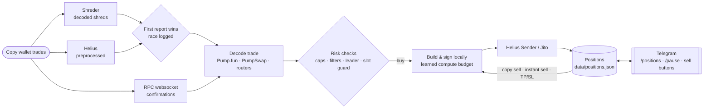

<div align="center">

# ⚡ Solana Copy-Trading Bot

**Mirrors chosen Solana wallets' trades on Pump.fun, PumpSwap and Raydium within milliseconds, controlled from Telegram.**


[Quick start](#-quick-start) · [How it works](#-how-it-works) · [Trade modes](#-trade-modes) · [Speed](#-built-for-speed) · [Rust fast path](#-rust-fast-path) · [Telegram](#-telegram-control) · [Full reference](docs/REFERENCE.md)

</div>

---

## ✨ Highlights

- **Sees trades before they land.** Shred streams (Helius preprocessed, Shreder, Jito gRPC) report the copy wallet's transaction as the slot leader produces it, hundreds of milliseconds before an RPC websocket would. Run two side by side and the bot uses whichever is first and logs which one won.
- **Builds its own transactions.** Pump.fun, PumpSwap and Raydium swaps are built and signed locally, with blockhash and config pre-fetched, so a buy needs at most one network round trip and often none. The fastest path writes the Pump.fun buy straight into bytes: about 0.3 ms from decision to signed transaction.
- **Lands early in the block.** Sends through Helius Sender (Jito plus staked connections) or Jito, sizes compute units from what each kind of trade really used, and can cancel a buy on-chain if it would land too many slots after the copy wallet's.
- **Exits as fast as it enters.** Mirrors sells proportionally, or sells the instant its own buy lands (`INSTANT_SELL`), with confirmed-only bookkeeping and automatic retries, so no position is forgotten.
- **Hard risk limits.** Per-trade and total exposure caps, a limit on open positions, a buy cooldown and market-cap filters. Pause buying from Telegram at any time while exits keep working.
- **Measures itself.** `[Timing]`, `[Race]`, `[Host]` and `[Usage]` log lines show where every millisecond and every RPC credit goes, plus a script that checks past buys by slot leader.

---

## 🧭 How it works



1. **Detect.** One or more shred feeds watch the copy wallets. The websocket feed runs alongside to confirm results and catch anything the shreds can't read.
2. **Decide.** The trade is decoded (including learned router formats). It is then checked against your limits, filters, slot leader distance and the slot guard.
3. **Execute.** The bot builds and signs the swap locally and sends it with your priority fee and tip. It then follows the result to confirmation.
4. **Exit.** Mirrors the copy wallet's sells, or sells immediately, or exits on take-profit, stop-loss or trailing stop, depending on the mode.

---

## 🚀 Quick start

**You need:** Node.js 20 or 22, a paid Solana RPC with websockets (e.g. Helius), and a **dedicated burner wallet** holding only what you're willing to trade.

```bash
# 1. Get the code
git clone https://github.com/Maxim-Karpov/solana-copy-trading-bot.git
cd solana-copy-trading-bot
npm install

# 2. Configure
cp .env.example .env
chmod 600 .env
nano .env               # RPC, wallet, copy wallets, mode, limits

# 3. Check and run
npm run check-env       # missing or misspelt settings (never prints values)
npm test                # 176 tests, fully simulated, no network or funds
npm start
```

**On a server**, run it under [pm2](https://pm2.keymetrics.io/) so it survives logouts and restarts after a crash:

```bash
npm install -g pm2
pm2 start ecosystem.config.js
pm2 logs copybot
pm2 save && pm2 startup     # start again after a reboot
```

> [!TIP]
> **Try it without buying.** Start paused, and the bot does a full *rehearsal* of every copy buy (built and signed, never sent) with timings. With `REHEARSE_ONLY="true"` it can never buy at all.

---

## 🎯 Trade modes

| Mode | Buy size | Exit |
|---|---|---|
| `EXACT` | Same SOL as the copy wallet | Any sell by the copy wallet sells 100% |
| `SAFE` | Fixed `BUY_AMOUNT` | Your own take-profit, stop-loss or trailing stop |
| `TIERED` | Scales with the copy wallet's buy (`TIER_BUY_CONFIG`) | Take-profit, stop-loss or trailing stop |
| `STIERED` | Scales with the copy wallet's buy | Mirrors its sells **proportionally**: it sells 40%, you sell 40% |

On top of any mode:
- **`INSTANT_SELL`** sells the moment the buy lands (optionally after `INSTANT_SELL_DELAY_MS`).
- **`SELL_AFTER_SECONDS`** sells a fixed time after the buy confirms.
- **`FULL_EXIT_ON_COPY_SELL`** treats any copy-wallet sell as a full exit.

`COPY_WALLET` takes several addresses separated by commas. Each position follows the sells of the wallet whose buy opened it.

---

## 🏎️ Built for speed

| What | Setting | What it does |
|---|---|---|
| Shred feeds | `SHRED_SOURCE` | `helius-preprocessed`, `shreder`, `jito-grpc`, or several comma-separated to race them |
| Feed race | `SHRED_SOURCE="shreder,helius-preprocessed"` | `[Race]` line per trade: who was first and by how many ms |
| No-lookup buys | `SHRED_FAST_BUY` | Builds Pump.fun buys straight from the shred data, with the price capped on-chain by `MAX_MARKET_CAP_SOL` |
| Hand-built buys | `HAND_BUILT_BUYS` (on) | Writes those buys straight into transaction bytes: ~0.3 ms to build and sign instead of ~2 ms, checked byte-identical to the SDK's |
| Rust fast path | `FAST_PATH="rust"` | A Rust program reads the shred feeds and builds, signs and sends those buys in ~0.05 ms; this bot does everything else ([setup](#-rust-fast-path)) |
| Sender | `SEND_VIA="sender"`, `SENDER_TIP` | Helius Sender, which sends via Jito and staked connections at once |
| Buy fees | `BUY_PRIORITY_FEE_SOL` | Higher priority fee for buys racing snipers; sells pay less |
| Compute budget | `AUTO_COMPUTE_UNITS`, `PUMPFUN_COMPUTE_UNITS` | Learns each trade kind's real usage, so the same fee buys a higher fee per CU |
| Slot guard | `MAX_SLOTS_BEHIND` | The buy cancels itself on-chain if it lands too long after the copy wallet's |
| Leader distance | `LEADER_MAX_KM` | Skips buys whose possible slot leaders are all too far from your server |
| Pre-warming | `PREWARM` (on) | Blockhash and Pump.fun config kept fresh; practice builds keep the code hot |

**Measuring tools**
- **`[Timing]` lines** split every shred buy into detecting, deciding, building, signing and sending. They also give the leader's city and the running same-block rate.
- **`[Host]` lines** report event-loop delay and stolen CPU, which tell you whether the server is the bottleneck.
- **`npm run leaders`** checks which of your past buys made the copy wallet's block, grouped by leader location and ping.
- **`npm run shreder-check`** proves a Shreder endpoint is reachable from this server in 20 seconds.

---

## 🦀 Rust fast path

The race part of the bot, in Rust (`fastpath/`). It reads the shred feeds itself, spots the copy wallet's Pump.fun buy, decides from the state the Node bot keeps it supplied with (sent the moment anything changes, so the decision never waits on it), then builds, signs and sends the buy. Build and sign take **~0.04 ms**, against ~0.3 ms for the hand-built Node buy and ~2 ms for the SDK. There are no garbage-collection pauses. Everything else stays in Node: positions, sells, instant sells, Telegram, and any buy the fast path isn't sure about.

**Safe by design**
- **Checked before it buys.** It buys only after building a practice buy that is byte-identical to the Node bot's. The check runs at startup and again every 30 s.
- **Fresh state only.** It needs a state snapshot under 1.5 s old; otherwise it leaves the buy to Node.
- **When in doubt, Node decides.** Anything else it's unsure of (an unknown router, a PumpSwap coin, a cap reached…) also goes to the Node bot, which handles it and says why, as before.
- **Falls back if it goes away.** If it stops, the Node bot opens its own shred feed after 5 s.

**Set up (once):**
```bash
curl --proto '=https' --tlsv1.2 -sSf https://sh.rustup.rs | sh -s -- -y
source ~/.cargo/env
sudo apt install -y build-essential
cd fastpath && cargo build --release && cd ..     # 2–5 min the first time
```
Then add `FAST_PATH="rust"` to `.env`, alongside `SHRED_FAST_BUY="true"`, `DIRECT_PUMPFUN_SWAP="true"` and `SHRED_SOURCE` with `shreder` and/or `helius-preprocessed`.

**Run:**
- **pm2:** `pm2 start ecosystem.config.js` starts both. Logs: `pm2 logs fastpath`.
- **No pm2:** run `./fastpath/target/release/fastpath` in one window and `npm start` in another.

**Update:**
```bash
unzip -o solana-copy-trading-bot-tiered.zip      # or: git pull
npm install && (cd fastpath && cargo build --release)
pm2 restart all                                  # or restart both windows
```

The first log line to look for is `[FastPath] The Rust fast path's buy is identical to this bot's, byte for byte`. Every buy it makes is logged with its timing: `BUY sent … 0.xx ms from seeing his buy to sending ours`.

---

## 📱 Telegram control

Set `TELEGRAM_BOT_TOKEN` and `TELEGRAM_CHAT_ID` and the bot reports every buy and sell with PnL, timing and links. It also takes these commands:

| Command | |
|---|---|
| `/positions` | Open positions with **Sell 50%**, **Sell all** and **Keep** buttons, plus **Close all** |
| `/pause` · `/resume` | Stop or restart copying buys (exits keep working) |
| `/stop` | Stop the bot after confirming (positions are **not** sold) |
| `/help` | List commands |

Alerts cover anything that needs you: a feed down, a failed sell, a skipped buy and why, or a safety stop.

---

## 🛡️ Safety

> [!WARNING]
> Copy trading memecoins is high risk: most coins go to zero, and faster bots can buy ahead of you. Use only funds you can afford to lose. This software comes with no warranty and is not financial advice.

- **Keys stay on the server.** `PRIVATE_KEY`, API keys and the Telegram token live only in `.env` (`chmod 600`), which git ignores. Never commit, paste or email it.
- **Logs hide secrets.** API keys in RPC URLs are redacted from every log line.
- **Use a burner wallet,** and log in to the server with SSH keys only.
- **Positions close only when the sell confirms on-chain.** Failed sells are retried, also after a restart.
- **Updates keep your data.** Your settings and `data/` (positions, learned routers and compute units) are never in the repo or the release zip.

---

## 🗂️ Project layout

```
src/
├── index.js            main loop: copy trades → checks → buys/sells → positions
├── config.js           loads and validates every setting
├── websocket.js        RPC websocket feed (logs or transaction subscribe)
├── shredFeed.js        shred feeds: Helius preprocessed, Shreder, Jito gRPC, the Rust fast path
├── fastPath.js         the link with the Rust fast path
├── feedRace.js         which shred feed reported each trade first
├── shredTx.js          reads legacy / v0 / v1 transactions from shreds
├── shredDecode.js      Pump.fun / PumpSwap / router trade intents, router learning
├── tradeExecutor.js    builds, signs and sends trades
├── pumpfunDirect.js    Pump.fun bonding-curve builder
├── pumpBuyRaw.js       the fast buy written straight into bytes
├── pumpswapDirect.js   PumpSwap AMM builder
├── raydiumDirect.js    Raydium AMM v4 / CPMM builder
├── computeBudget.js    learned compute-unit limits
├── heliusSender.js     Helius Sender client
├── slotGuard.js        on-chain "too late" cancel (MAX_SLOTS_BEHIND)
├── leaderInfo.js       slot-leader schedule and locations
├── buyTiming.js        [Timing] lines and same-block rate
├── hostStats.js        [Host] lines: event loop and CPU
├── telegramBot.js      Telegram control and notifications
└── storage.js          positions on disk
fastpath/               the Rust fast path (cargo build --release)
scripts/                check-env · leaders · shreder-check
test/                   unit + end-to-end tests (network simulated)
docs/REFERENCE.md       every setting and feature in detail
```

---

## 📚 Documentation

- **[docs/REFERENCE.md](docs/REFERENCE.md):** every feature and setting in detail, covering direct swaps, shred streams, timing, Sender, RPC failover, rate limits, Telegram and PnL.
- **[.env.example](.env.example):** every setting with its default and an explanation.

---

## 🙏 Credits & license

Built on [ahk780/solana-copy-trading-bot](https://github.com/ahk780/solana-copy-trading-bot) and extended with shred feeds, direct builders, Sender, timing and leader tools, a learned compute budget, instant sells and much more. MIT licensed.
